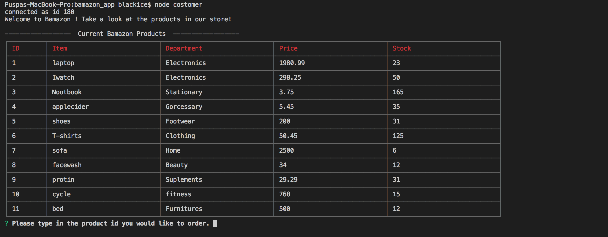
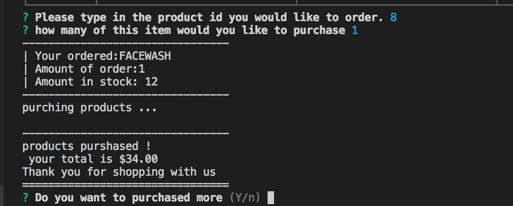
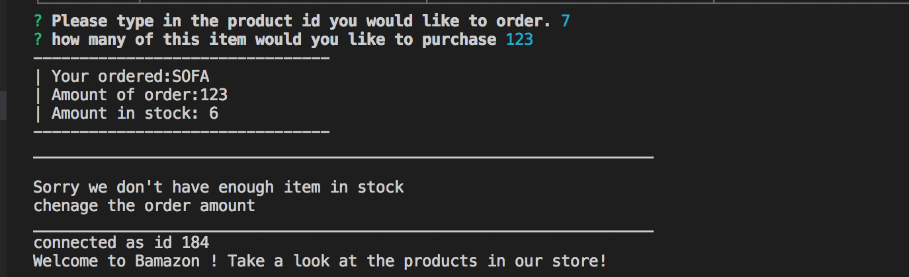

# bamazon_app

This is an Amazon-like storefront built with MySQL and Node.js. 

Within the customer portal, you can view the product list  in table 

choose an item you'd like to purchase
along with the quantity, if we have enough stock then it will processed and complete the order and ask if you need more item

if we do not have enough 
of the selected item in stock deeming us unable to fulfill your purchase, the transaction 
will not go through. it gives you another chance to purchase
