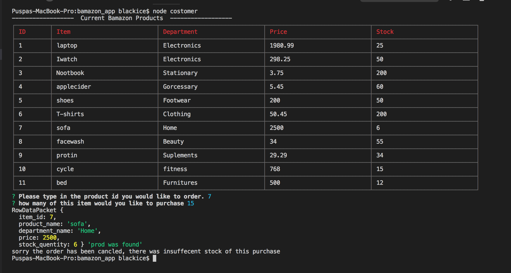

# bamazon_app

This is an Amazon-like storefront built with MySQL and Node.js. 

Within the customer portal, you can view the product list  in table , choose an item you'd like to purchase
along with the quantity, , if we do not have enough 
of the selected item in stock deeming us unable to fulfill your purchase, the transaction 
will not go through.
